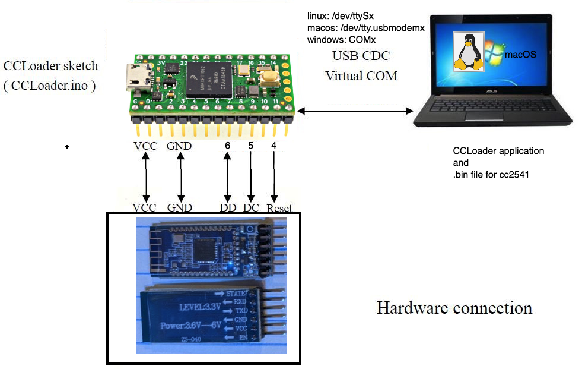

# CCLoader
========

Burn CC254x firmware using an Teensy 4.0 board.

1. Load the [CCLoader Arduino sketch](./Arduino/CCLoader/CCLoader.ino) in Tenensyduino version 1.59+.
2. Connect the pins between the HM-10 module and the Teensy 4.0:
  
  
These are the pins to connect:
|Device|pins to<br> connect|pins to<br> connect|pins to<br> connect|
|-:|:-:|:-:|:-:|
|*Teensy 4.0*| 4| 6 | 5|
|*HM-10 BLE*| 11 (aka __RESET__)| 8 (aka __DD__)| 7 (aka __DC__)  |


     Notes: on my module, I have the following:
       - P2_1(DEBUG_DATA) is pin 8 on the BLE module.
       - P2_2(DEBUG_CLOCK) is pin 7 on the BLE module.
       - RSTB (DEBUG_RESET) is pin 11 on the BLE module.
     Please double check which pins your module is exposing the DD, DC and RESET signals.

3. Build with CMake the CCLoader tool for Linux/macOS/Windows.
   
```bash
   >cmake -S . -B build -DCMAKE_BUILD_TYPE=Release
   >cmake --build build
````

4. Run the sketch in Teensyduino, you should read "Started" printed in the Serial Terminal.
   Close the Serial Monitor window: this is necessary to release the serial port that must 
   be used by the CCLoader console application you just built.
5. Run the CCloader executable to load the firmare.

```   
   >./build/bin/CCLoader /dev/tty.usbmodem1234 ./Bin/CC2541hm10v540.bin 
```

where:
 - `/dev/tty.usbmodem1234`: this is the serial device that connect your computer to the Teensy 4.0. This is on macOS, on Linux or Windows use the appropriate port name.
 - the `.bin` file is the firmware you want to write.